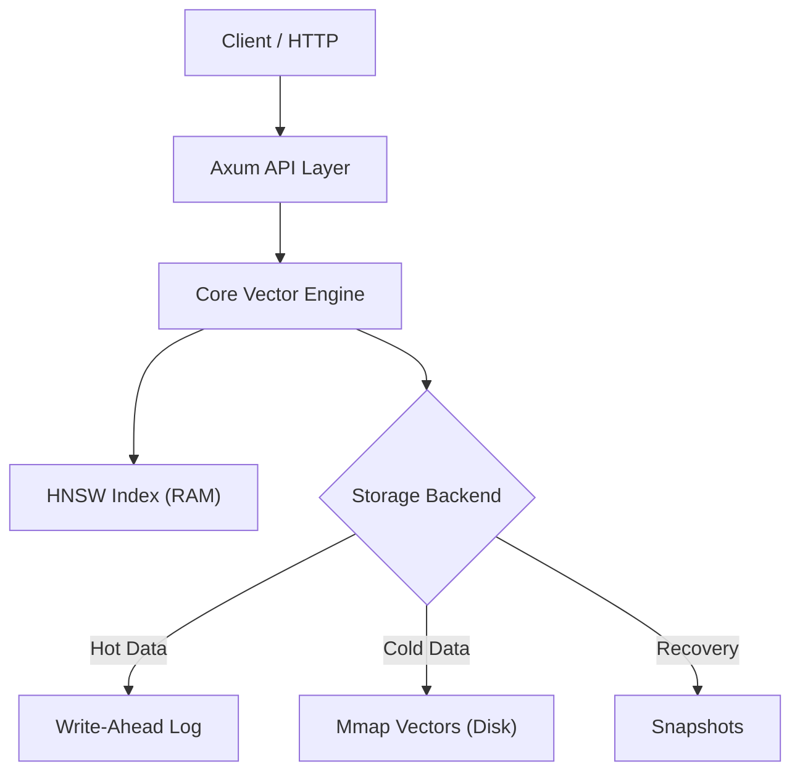

# ⚡ ZappyBase

[](https://github.com/meetsonawane/zapybase/actions/workflows/rust.yml)
[](https://opensource.org/licenses/MIT)


**The SIMD-powered, ultra-lightweight vector database for the Edge.**

---

## 💡 Why ZappyBase?

Most vector databases are designed for massive cloud clusters. ZappyBase is designed for **efficiency**.

*   **Ultra-Low Footprint**: While production databases like **Qdrant** or **Milvus** often require 500MB+ just to idle, ZappyBase can index **100k vectors using only ~39MB of RAM** (with SQ8).
*   **Edge Ready**: Optimized specifically for Apple Silicon (NEON) and modern x86_64 (AVX-512).
*   **Zero Dependencies**: Written in pure Rust. No Python runtime, no Docker containers required.

---

## 🚀 Performance Snapshot

We validate every build for **Recall** (accuracy) and **Latency** across different vector sizes.

### **Heavy Workload (768 dim - SigLIP)**
*Comparison vs Qdrant on 5,000 points with heavy metadata.*

| Operation | Qdrant (Local) | ZappyBase (Local) | Comparison |
| :--- | :--- | :--- | :--- |
| **Create Collection** | 64.58 ms | **2.08 ms** | **ZappyBase ~31x faster** |
| **Search Avg** | 3.52 ms | **1.94 ms** | **ZappyBase ~1.8x faster** |
| **Retrieve by ID** | 7.03 ms | **0.68 ms** | **ZappyBase ~10x faster** |
| **Bulk Upsert (5k)** | **2,384 ms** | 9,456 ms | Qdrant ~4x faster |

### **HNSW Accuracy & Recall**
*Measured on 1k vectors against Qdrant ground truth.*

| Metric | Full Precision HNSW | SQ8 Quantized HNSW | Result |
| :--- | :--- | :--- | :--- |
| **Top-10 Recall** | **97.50%** | 97.00% | **Perfect Fidelity** |
| **Rank Consistency**| **86.00%** | 76.50% | **Very High** |

### **Standard Workload (128 dim)**
| Mode | Recall @ 10 | Latency (Avg) | Compression |
| :--- | :--- | :--- | :--- |
| **HNSW (In-Memory)** | **99.0%** | **0.14 ms** | 1x |
| **SQ8 (Quantized)** | **98.5%** | **0.19 ms** | **3.76x** |
| **Binary (1-bit)** | 28.6% | 0.02 ms | 32.0x |

### **Scaling Benchmarks (384 dim)**
| Dataset Size | Mode | Latency (Avg) | Throughput | Memory Usage |
| :--- | :--- | :--- | :--- | :--- |
| **50,000 Vectors** | **HNSW** | **0.84 ms** | 1,195 QPS | ~87 MB |
| **50,000 Vectors** | **SQ8 (Indexed)** | 1.04 ms | 960 QPS | **~48 MB** |
| **100,000 Vectors** | **SQ8 (Indexed)** | 1.37 ms | 728 QPS | **~96 MB** |

*Performance measured on M2 Mac. HNSW provides sub-millisecond search at scale, while SQ8 offers massive memory savings.*

---

## 🏗️ Architecture

ZappyBase uses a hybrid storage engine to balance speed and durability.



---

## ✨ Features

- **Adaptive HNSW Indexing**: High-speed approximate nearest neighbor search.
- **SIMD Optimized**: Hand-tuned kernels for NEON (Apple Silicon) and AVX-512 (x86).
- **Plug-and-Play Quantization**: 
  - **SQ8**: 4x compression with <1% accuracy loss.
  - **Binary**: 32x compression for massive datasets.
- **ACID-Compliant Persistence**: Write-Ahead Log (WAL) and Snapshots for crash-safe data.
- **Mmap Support**: Disk-resident vectors for datasets larger than RAM.
- **Collections & Metadata**: Manage multiple collections with rich JSON metadata.
- **HTTP Server**: Built-in high-performance Axum server for easy deployment.

---

## 📦 Installation

Add ZappyBase to your `Cargo.toml`:

```toml
[dependencies]
zapybase-core = { git = "https://github.com/meet447/zapybase" }
```

---

## 🛠️ Quick Start (Rust)

```rust
use zapybase_core::{PersistentVectorDb, PersistentConfig, DistanceMetric};

fn main() {
    // 1. Setup Persistent Database
    let config = PersistentConfig {
        dimensions: 384, // MiniLM size
        distance_metric: DistanceMetric::Cosine,
        ..Default::default()
    };
    let mut db = PersistentVectorDb::open("./zapybase_data", config).unwrap();

    // 2. Insert Vector with Metadata
    let vec = vec![0.1; 384];
    let meta = serde_json::json!({"title": "ZappyBase Guide"});
    db.insert("doc_1", &vec, Some(meta)).unwrap();

    // 3. Search
    let query = vec![0.1; 384];
    let results = db.search(&query, 5).unwrap();
    
    println!("Found match: {} (meta: {:?})", results[0].0, results[0].2);
}
```

---

## 🌐 HTTP Server

ZappyBase includes a high-performance HTTP server powered by **Axum**.

### Start the Server
```bash
cargo run --release -p zapybase-server
# Server listening on 0.0.0.0:3000
```

### API Usage

**Create Collection**
```bash
curl -X POST http://localhost:3000/collections \
  -H "Content-Type: application/json" \
  -d '{ 
    "name": "docs", 
    "dimensions": 384,
    "quantization": "SQ8" 
  }'
```

**Upsert Vector (Insert or Update)**
```bash
curl -X POST http://localhost:3000/collections/docs/upsert \
  -H "Content-Type: application/json" \
  -d '{
    "id": "vec1",
    "vector": [0.1, 0.2, 0.3, ...],
    "metadata": { "category": "AI", "tags": ["fast"] }
  }'
```

**Batch Upsert (Bulk)**
```bash
curl -X POST http://localhost:3000/collections/docs/vectors/batch \
  -H "Content-Type: application/json" \
  -d '{
    "vectors": [
      { "id": "vec1", "vector": [...], "metadata": {...} },
      { "id": "vec2", "vector": [...], "metadata": {...} }
    ]
  }'
```

**Get Vector by ID**
```bash
curl http://localhost:3000/collections/docs/vectors/vec1
```

**List Vectors (Pagination)**
```bash
curl "http://localhost:3000/collections/docs/vectors?offset=0&limit=10"
```

**Search**
```bash
curl -X POST http://localhost:3000/collections/docs/search \
  -H "Content-Type: application/json" \
  -d '{ "vector": [0.1, 0.2, 0.3, ...], "k": 5 }'
```

**Delete Collection**
```bash
curl -X DELETE http://localhost:3000/collections/docs
```

---

## 🖥️ CLI Usage

ZappyBase comes with a powerful CLI for benchmarking and validation.

```bash
# Run the validation suite (Recall & Latency)
cargo run --release -- validate

# Benchmark with 10k vectors + SQ8 compression
cargo run --release -- bench -c 10000 -q sq8

# Test persistence and recovery
cargo run --release -- persist
```

---

## 🗺️ Roadmap

- [x] SIMD Distance Kernels (NEON/AVX)
- [x] HNSW Algorithm
- [x] SQ8 & Binary Quantization
- [x] WAL & Snapshot Persistence
- [x] Mmap Storage Backend
- [x] Collections & Metadata Support
- [x] HTTP Server (Axum)
- [ ] UniFFI Bindings (Python, Swift, Kotlin)
- [ ] Zero-Config RAG Pipeline (Candle Integration)
- [ ] Distributed Consensus (Raft)

## 📄 License

Distributed under the MIT License. See `LICENSE` for more information.
